# 🎯 花花公考刷题

一站式国考/省考刷题平台：行测 + 申论全题库在线刷题、AI 申论评分、备考资料中心。基于若依 RuoYi-Vue3 前后端分离架构。

> 📖 想知道每个功能页是怎么实现的？看 [功能实现说明](docs/功能实现说明.md)（各页面实现方式 + 关键代码 + 后端 API 一览）

---

## ✨ 功能总览

### 📝 刷题中心
| 功能 | 说明 |
| ---- | ---- |
| **试卷练习** | 国考/各省/深圳市/事业编共 **167 套行测真题、19595 题**，按年份与省份分类，断点续练、逐题解析 |
| **专项练习** | 按题型（常识/言语/数量/判断/资料/全部混刷）随机抽题，可选题量 |
| **错题本** | 错题自动汇总，含我的答案/正确答案/解析/材料，可移出或清空 |
| **每日一练** | 每天 10 题混刷，保持手感 |

### ✍️ 申论刷题（含 AI 评分）
- **700 套** 国考/省考申论真题、2907 题，全部带参考答案
- 材料阅读 + 一字一格答题卡（支持中文输入法）
- 交卷后调用大模型 **AI 评分**：逐题打分 + 专业点评（需配置 `HUAHUA_AI_KEY` 环境变量）

### 📚 备考中心
| 功能 | 说明 |
| ---- | ---- |
| **学习计划** | 90 天备考计划 + 打卡日历（连续打卡统计） |
| **学习报告** | 答题量/正确率/题型分布统计 |
| **成语积累** | 110 个高频/易错/辨析成语，学习 + 测验双模式 |
| **申论规范词** | 大白话 → 机关语言翻译练习 |
| **时政速递** | 央视《新闻联播》+ 新华社评论员实时简讯 |
| **速记卡片** | 高频考点卡片速记 |
| **申论素材** | 16 篇范文 + 12 套万能模板 |
| **词语辨析** | 290 条高频词语，看词选义/看义选词练习 |
| **高频词语** | 每日一批打卡式积累 |
| **生词锦囊** | 收藏生词、标记掌握、手动添加 |
| **计时工具** | 行测各模块/申论整卷倒计时，练习记录 |
| **行测助手** | 口算练习 12 种基础题型 + 7 种资料速算 + 舒尔特方格 + 数字谜题 |

### 📖 资料教程
小白 → 进阶 11 篇教程（含图片），B 站视频目录

---

## 📸 界面预览

| | |
| ---- | ---- |
|  | 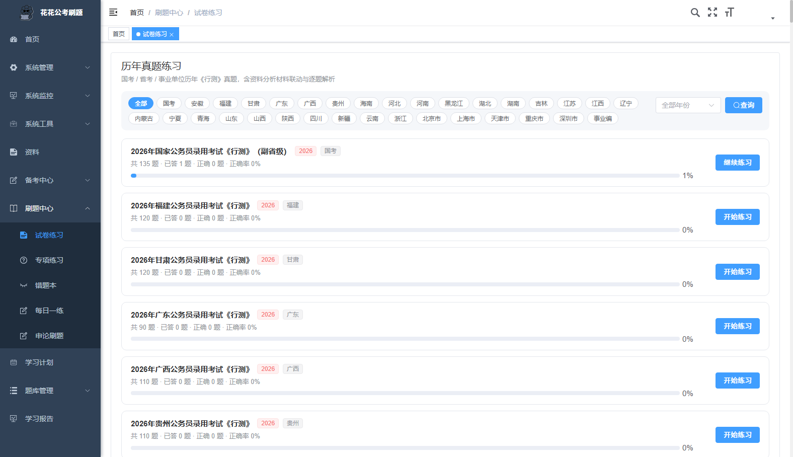 |
|  | 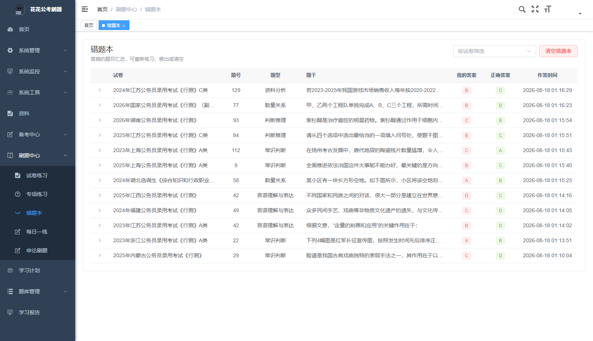 |
| 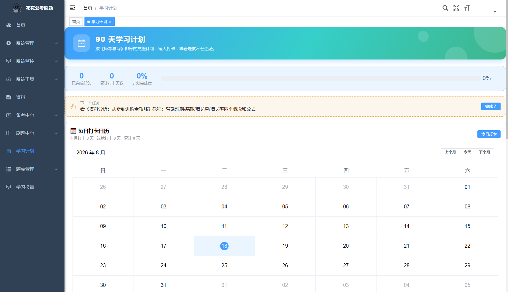 | 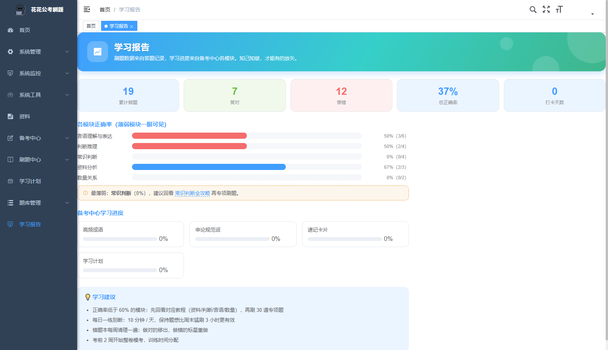 |
|  | 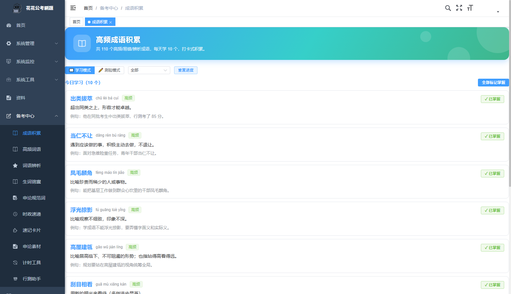 |
| 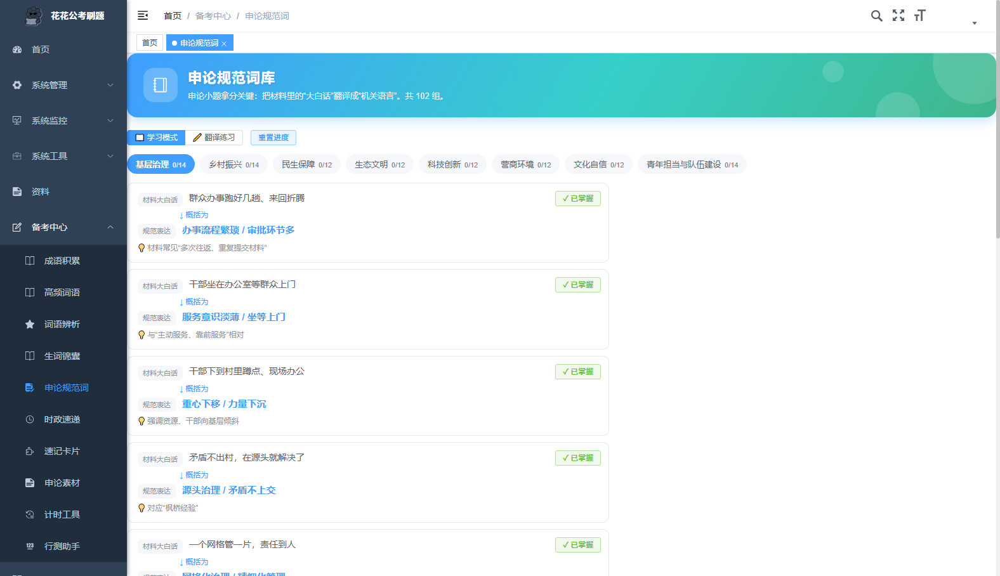 | 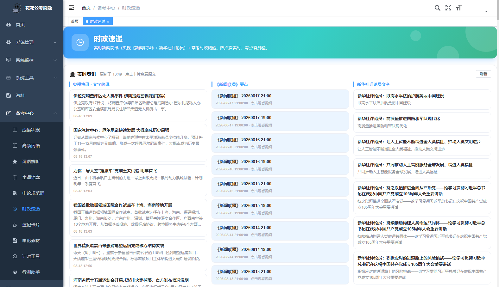 |
| 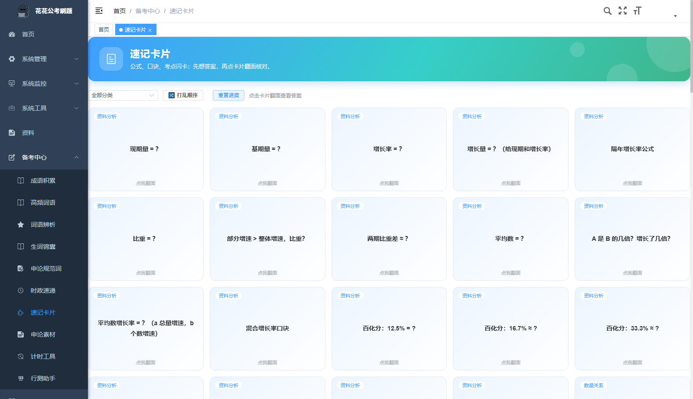 | 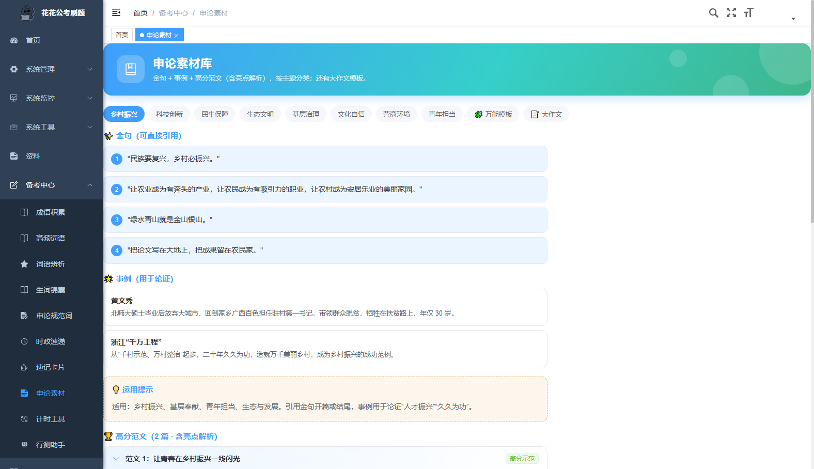 |
| 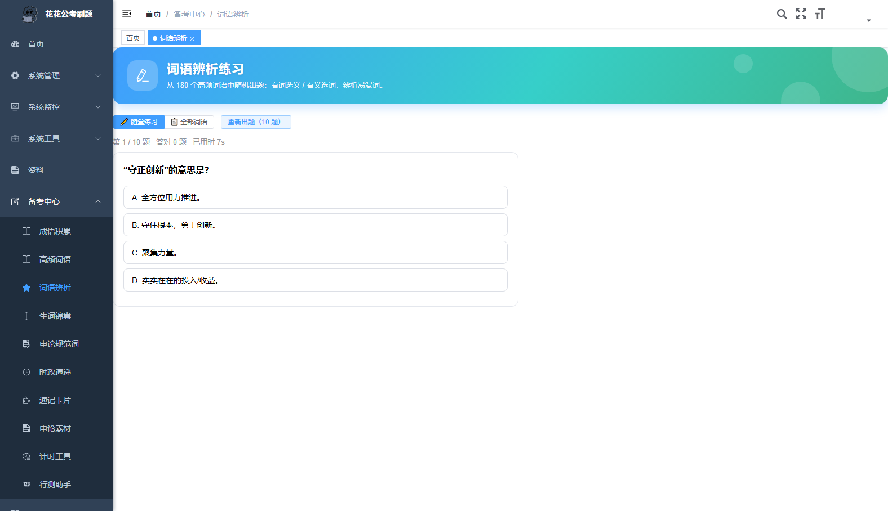 | 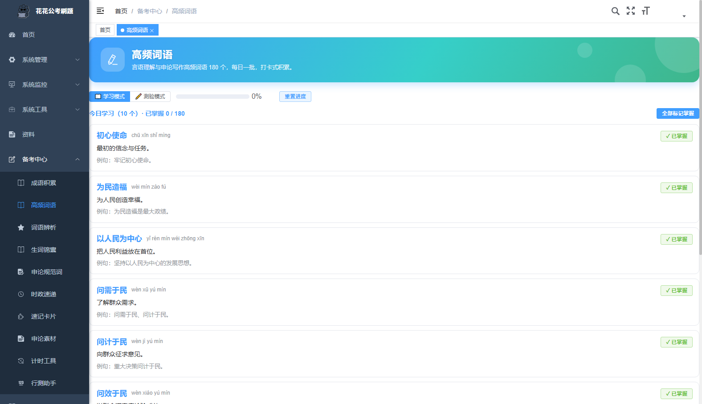 |
| 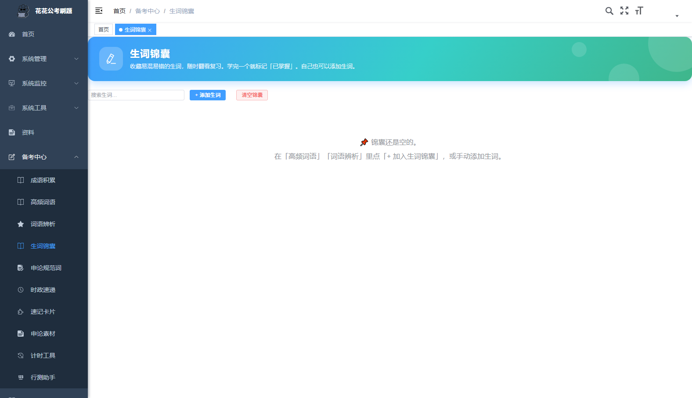 | 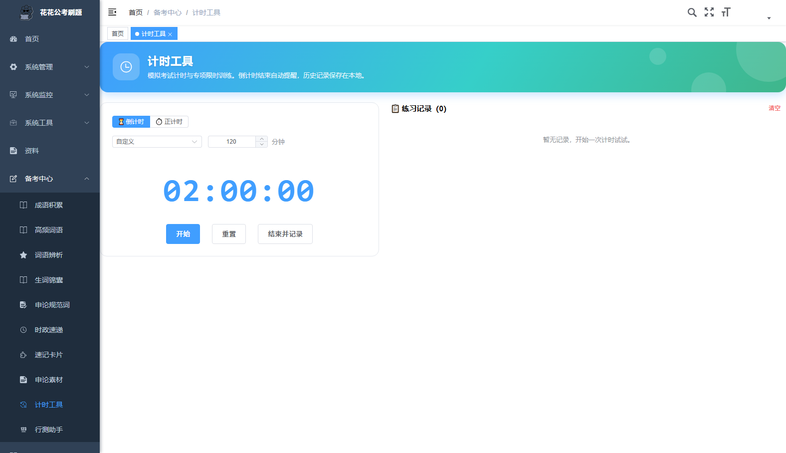 |
| 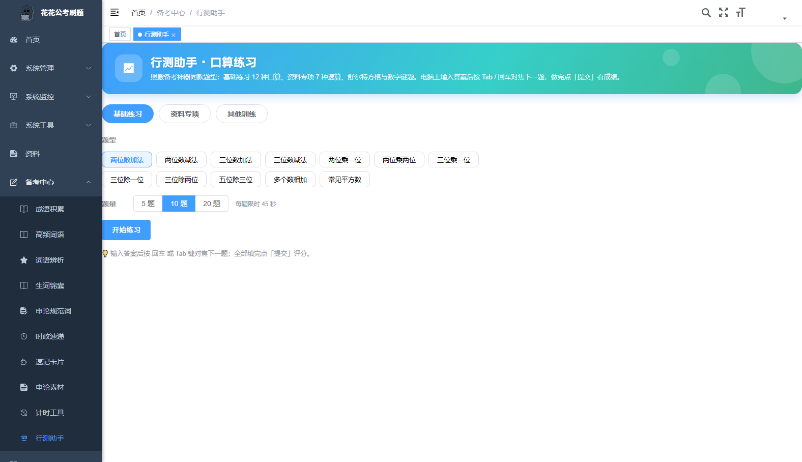 | 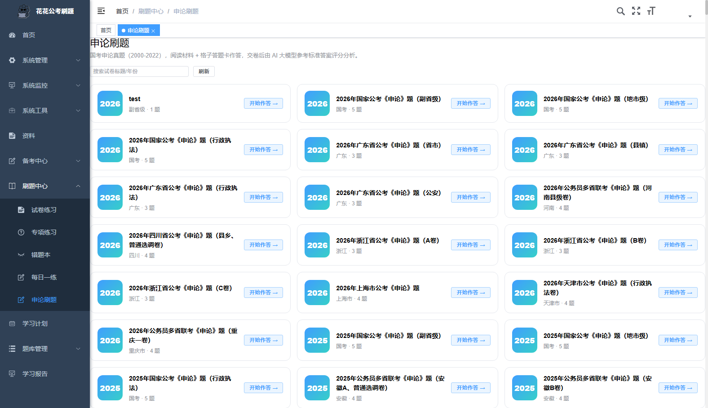 |

---

## 🚀 快速开始

### 环境要求
- **Node.js 18+**（前端构建）
- **JDK 8+ 与 Maven**（后端构建）
- **MySQL 5.7+** 与 **Redis**（数据存储）

### 1. 安装依赖与构建
```bat
:: 一键安装前端依赖、构建前端、构建后端（Windows）
install.bat
```

### 2. 初始化数据库
按顺序在 MySQL 中导入（库名 `ruoyi`，账号 root / 密码 123456）：
```sql
-- 1. 若依基础表 + 菜单
source ruoyi-backend/sql/ry_20240629.sql;
-- 2. 刷题表结构 + 基础菜单
source data/sql/exam_schema.sql;
-- 3. 申论表结构 + 申论菜单
source data/sql/shenlun_schema.sql;
-- 4. 备考中心等全部业务菜单（必做！否则页面打不开）
source data/sql/menus_prep_full.sql;
-- 5. 行测题库（167 套 / 19595 题）
source data/sql/exam_data_full.sql;
-- 6. 申论题库（700 套）
source data/sql/shenlun_data_full.sql;
```
> ⚠️ 第 4 步 `menus_prep_full.sql` 不能省略：它补全「备考中心/学习计划/学习报告/词库/计时工具/行测助手」等全部菜单并授权给角色，缺了会导致大量页面无法访问。

### 3. 配置 AI 评分（可选）
申论 AI 评分通过环境变量配置，未配置时仅 AI 评分不可用，其余功能正常：
```bat
setx HUAHUA_AI_KEY "你的API密钥"
setx HUAHUA_AI_BASE_URL "https://api.deepseek.com/anthropic"   :: 可选，默认此值
setx HUAHUA_AI_MODEL "deepseek-v4-flash"                        :: 可选，默认此值
```

### 4. 一键启动
```bat
start-all.bat
```
自动启动 MySQL / Redis / 后端 / 前端并打开浏览器。

| 项目 | 地址 |
| ---- | ---- |
| 刷题网站 | http://127.0.0.1:8090 |
| 后端 API | http://127.0.0.1:8080 |
| 登录账号 | admin / admin123（验证码可填任意 4 位） |

---

## 🛠️ 技术栈

- **前端**：Vue 3 + Vite 5 + Element Plus + Pinia + ECharts（RuoYi-Vue3 v3.8.8）
- **后端**：Spring Boot 2.5 + MyBatis + Druid + Redis（RuoYi-Vue v3.8.8，JDK 8）
- **数据库**：MySQL 5.7（行测 167 套 / 申论 700 套）
- **AI 评分**：DeepSeek（Anthropic 兼容接口）

## 📁 目录结构

```
├── ruoyi/                  # 前端（Vue3）
├── ruoyi-backend/          # 后端（Spring Boot）
├── data/
│   ├── images/             # 题库图片（gitignore，不入库）
│   └── sql/                # 数据库结构与题库数据
├── docs/screenshots/       # 界面截图
├── tools/                  # 爬虫/工具脚本
├── install.bat             # 一键安装
└── start-all.bat           # 一键启动
```

## ⚠️ 说明

- 题库数据来源于公开网站整理，仅用于学习交流，请勿商用
- 图片目录 `data/images/` 因体积未入库，缺失时题目图片不显示，不影响做题与解析
- 如需重新爬取题库，参见 `tools/` 下的 `crawl_all.py`（行测）与 `crawl_sl.py`（申论）
